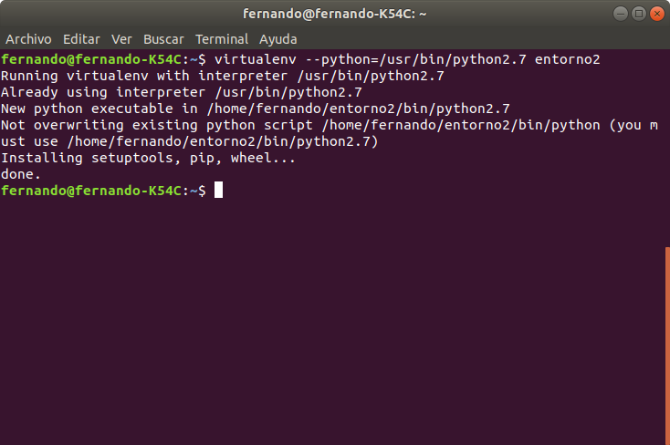

Para la realización de este ejercicio y los siguientes utilizaremos el lenguaje Python debido a que este será el que usemos para la realización del proyecto de la asignatura.

## Instalar alguno de los entornos virtuales de node.js (o de cualquier otro lenguaje con el que se esté familiarizado) y, con ellos, instalar la última versión existente, la versión minor más actual de la 4.x y lo mismo para la 0.11 o alguna impar (de desarrollo).

Para realizar este ejercicio y siguiendo lo comentado en la teoría del tema, utilizaremos la biblioteca de Python virtualenv. Como se puede ver en su [documentación](https://virtualenv.pypa.io/en/latest/installation/) basta con utilizar el comando `sudo pip3 install virtualenv`. Debido a que yo ya tenia dicha herramienta instalada en mi ordenador se muestra el mensaje que se puede ver en la siguiente imagen:

Una vez creado, para crear un entorno virtual de python en una versión especifica tendremos primero que comprobar que versiones tenemos disponibles en nuestro ordenador. Basta con introducir el siguiente comando en la consola de comandos: `find /usr/bin -iname Python*`.

El resultado se puede ver en la siguiente pantalla captura

Una vez localizado esto y como se puede ver en la página de la [documentación](https://virtualenv.pypa.io/en/latest/reference/) de la herramienta, tendremos que utilizar el argumento `-Python=Python_EXE` especificando la ruta al ejecutable de la versión de python que queramos usar para crear el entorno virtual.

El resultado de la creación de un entorno virtual de Python en la versión más reciente y de un entorno con una versión más antigua e impar se puede ver en las siguientes imágenes.

## Crear una descripción del módulo usando package.json. En caso de que se trate de otro lenguaje, usar el método correspondiente.

Para realizar este ejercicio utilizaremos Python. En este lenguaje y más concretamente en pip existe de forma análoga a package.json los ficheros de requerimientos, en estos ficheros podremos especificar las dependencias entre módulos para ello basta con incluir en el fichero la línea `sqlite3>=3.0` y más tarde bastaría con realizar `pip install -r requerimientos.txt`. Sin embargo, sqlite3 ya está instalado por defecto en python3 por lo que no será necesario instalarlo.

## Descargar el repositorio de ejemplo anterior, instalar las herramientas necesarias (principalmente Scala y sbt) y ejecutar el ejemplo desde sbt. Alternativamente, buscar otros marcos para REST en Scala tales como Finatra o Scalatra y probar los ejemplos que se incluyan en el repositorio.

Siguiendo los pasos en el [repositorio](https://github.com/JJ/spray-test) primero descargamos el repositorio con el siguiente comando:
`git clone git://github.com/JJ/spray-test my-project`

Tambien habrá que instalar sbt, java y scala. Para ello se han seguido las instrucciones que se pueden consultar en este [enlace](https://www.scala-sbt.org/1.x/docs/Installing-sbt-on-Linux.html) y en este [enlace](https://www.digitalocean.com/community/tutorials/how-to-install-java-with-apt-on-ubuntu-18-04)

Una vez instalado todo y siguiendo con las instrucciones del repositorio, solo deberemos instroducir el comando `sbt` para ejecutar el entorno. Posteriormente introduciremos `test` y `re-start` para ejecutar los test y posteriormente ejecutar el servicio.

Una vez hecho esto podemos hacer pruebas como se recomienda en el repositorio:

